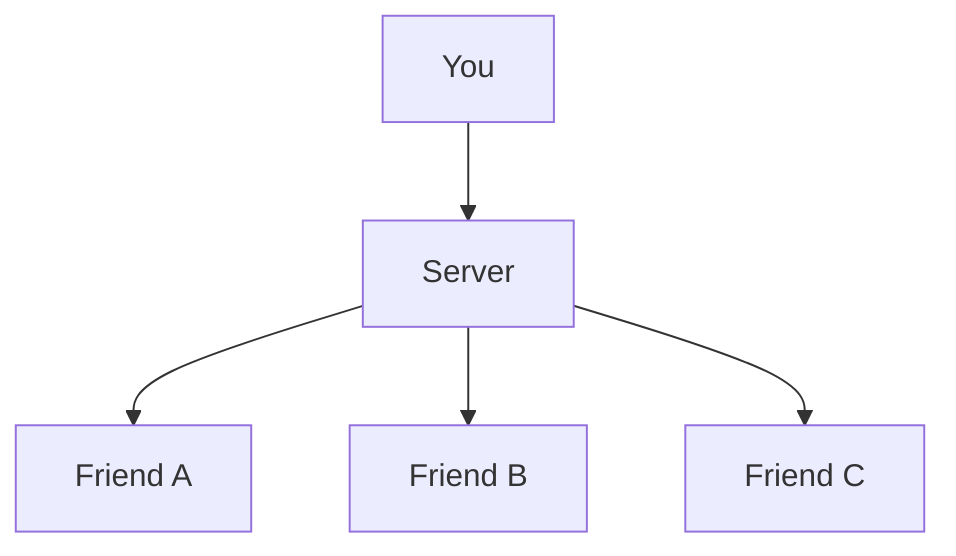

# </img> IPCom
IPCom is an offline messaging application that allows users to send messages without an internet connection. It uses IP to send messages between devices. This makes it ideal for situations where there is no internet connection available but you still need to communicate with others. The matter is to have on same Network!

## How it works?
It needs a server to work. When the server is online anyone with the same network will able to connect with the server and send message with others connected with the same server. Say `You` and 3 of your friends are connected on a server, the communication is done as this diagram shows:

## Installation
Download the [Latest IPCom Installer](https://github.com/Sayad-Uddin-Tahsin/IPCom/releases/latest) now from [Releases](https://github.com/Sayad-Uddin-Tahsin/IPCom/releases)!

### Installer Contains
 - IPCom
   - Let you connect to a server and chat
 - IPCom Server
   - Let you create a new server

## License
This project is licensed under the [MIT License](./LICENSE).
